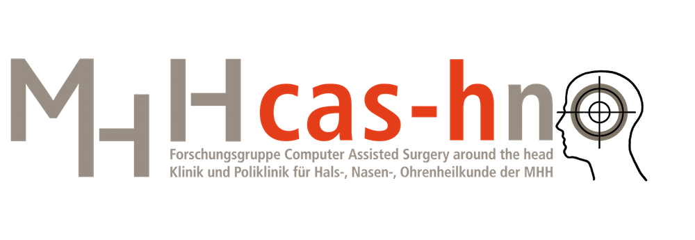

title: CAS-hno - Computer-assistierte Chirurgie und Elektrodenentwicklung

 - - - 
 

## Forschung

{style="width:350px; float:right; margin-left:3em"}

Die Arbeitsgruppe "Computer-assistierte Chirurgie und Elektrodenentwicklung" (CAS-hno) ist ein interdisziplinäres Forschungsteam aus Ingenieuren, Naturwissenschaftlern und Ärzten innerhalb der Klinik für HNO-Heilkunde der MHH. Der Forschungsschwerpunkt der Arbeitsgruppe liegt auf der Entwicklung von Technologien und Methoden zur chirurgischen Rehabilitation des Innenohrs (Cochlea).

Die Forschung der AG beschäftigt sich mit der Nutzung von Verfahren der computer-assistierten Chirurgie (CAS) auf der Basis hochauflösender Bildgebungstechnologien, um die Präzision und Sicherheit operativer Eingriffe, insbesondere an der lateralen Schädelbasis, zu erhöhen. Dazu zählen der Einsatz intraoperativer Navigationstechnik, mechatronischer Assistenzsysteme und Verfahren der computergestützten Simulation und prä-operativen Planung. Basierend darauf ist es das weiterführende Ziel, adaptive Cochlea-Implantat (CI)-Elektroden zu entwickeln und in das Gesamtkonzept eines minimal-traumatischen, resthörerhaltenden Zugangs zur Cochlea zu integrieren.

Der zweite Forschungsschwerpunkt der AG umfasst die Weiterentwicklung des Elektrodenträgers (ET) von Cochlea-Implantaten (CIs) und der dazugehörigen Insertionstechnik. Die Arbeitsgruppe bearbeitet dabei den gesamten Design- und Entwicklungsprozess. Die verwendeten Methoden umfassen: Bildgebung und  drei-dimensionale (3D) Modellierung des humanen Innenohrs, Weiterentwicklung des Elektrodenträger-Designs mittels computer aided design (CAD) Software und Finite-Elemente-Analyse (FEA), die Simulation und Optimierung des Insertionsprozesses, experimentelle Charakterisierung  des Elektrodenträgers durch manuelle und/oder automatisierte Insertion in Cochlea-Modelle und/oder humane Felsenbeinpräparate. Besonderer Fokus liegt dabei auf der Funktionalisierung des Elektrodenträgers mittels Integration von Aktuatoren zur individuellen Anpassung der Form des ETs an die Spiralform des Innenohrs (Cochlea) zur Verbesserung des Restgehörerhalts. Untersuche Aktuatoren umfassen dabei Formgedächtnislegierungen, tubuläre Manipulatoren und nachgiebige Mechanismen basierend auf fluidisch-aktuierten Aktuatoren.

 - - -
 
## Forschungsschwerpunkte

### Bildgebungstechnologien
- Bildgebung der Innenohres (Cochlea) und der lateralen Schädelbasis
- Bildgebung von Cochlea-Implantaten nach Insertion
- Computer-Tomographie (CT), digitale Volumen-Tomographie (DVT), Micro-CT, 3D Histologie ([microgrinding](majdani/methods/microgrinding.html "Schliffpräparation"))

### Bildverarbeitung und Softwareentwicklung
- Visualisierung und Verarbeitung von medizinischen Bilddaten
- manuelle und semi-automatische Segmentierung
- Planung von (Insertions-) Trajektorien
- Berechnung und Visualisierung der Knochendicke (lat. Schädelbasis)
- Visualisierung der Cochleaanatomie mittels rotierender mid-modiolarer Schnittebenen
- Softwareentwicklung mit C++, VTK, ITK, Matlab, Mathematica, LabView

### 3D-Modellierung
- anatomische Modelle der lateralen Schädelbasis und des chirurgischen Zugang zum Innenohr
- Finite-Elemente-Modellierung des humanen Innenohrs and des Elektrodenträgers
- Planung und Fertigung physikalischer Modelle des humanen Innenohrs (künstliche Cochlea-Modelle)

### Entwicklung und Evaluierung von medizintechnischer Geräte
- chirurgische Assistenzsysteme für die minimal-invasive Cochlea-Implantat-Chirurgie
- chirurgische Instrumente und medizintechnische Geräte, wie:
	- Bild-gestützte Chirurgie-Systeme
	- Medizinroboter
	- Mini-Stereotaxie-Rahmen
	- manuelle und automatisierte Insertionstools
	- Bohrertools, Laser-Handstücke und Endoskope

### Elektrodenentwicklung für Cochlea-Implantate (CIs)
- Funktionalisierung mit Aktorik (Formgedächtnislegierungen, Fluid-mechanische Aktuatoren, tubuläre Manpulatoren)
- Individualisierte Implantate (Formveränderung, Krümmungsanpassung, Länge, Dicke)
- virtuelles Prototyping mit Finiter-Elemente-Modellierung
- Simulation und Optimierung des individuellen Insertionsprozesses

### Charakterisierung von CI-Elektrodenträgern
- 3-Punkt-Biegeversuch
- Vermessung des individuellen Krümmungsverhalten von CIs
- manuelle und automatisierte Insertionsversuche in künstliche Cochleamodelle und humane Felsenbeinpräparate
- (Insertions-) Kraftmessung
- Histologie und Evaluierung des Insertionstraumas

- - - 

** Kontakt: Dr.-Ing. Thomas S. Rau**

    VIANNA - Institut für Audioneurotechnologie
    der Klinik für Hals-, Nasen-, Ohrenheilkunde
    Medizinische Hochschule Hannover
    Stadtfelddamm 34
    30625 Hannover
    
	Tel: +49 511/532-3025
    Mail: rau.thomas@mh-hannover.de
