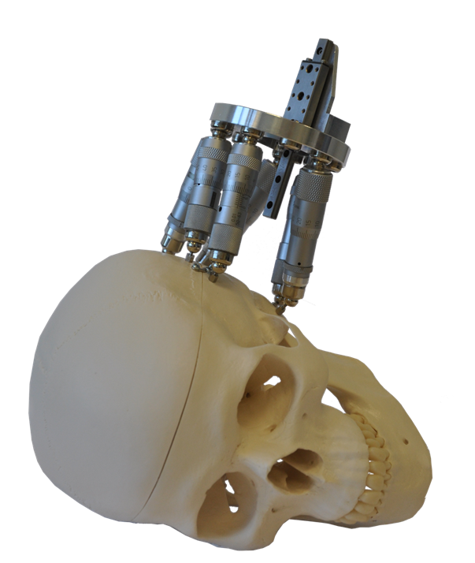

title:Projects

## Hearing4all - Electromechanical Stimulation of the Cochlea (EMS)

### Project Partners: 
	
Leibniz Universität Hannover, [Institute of Micro Production Technology](http://www.impt.uni-hannover.de/das_impt.html?&L=1 "Institute of Micro Production Technology")

Leibniz Universität Hannover, [Institute of Dynamics and Vibration Research](http://www.ids.uni-hannover.de/ueber_uns.html?&L=1 "Institute of Dynamics and Vibration Research")

### Aims:

Development of a novel implant allowing for simultaneous electrical and mechanical cochlea stimulation
	
Reserach has shown that in case of residual hearing, the best hearing perception can be achieved by simultaneous employment of a hearing aid and cochlear implant. 
Motivated by this discovery, the project aim is to develop a single implant capable of both electrical and mechanical cochlea stimulation. The main task herein is the development, layout and optimization of miniaturized actuators which can be incorporated into existing cochlear implants.
	
#### Contact: Dr. Wouter J. van Drunen | vanDrunen.Wouter@mh-hannover.de

## Hexapod

### Minimally invasive cochlear implant surgery
-  Drilling a direct access to the cochleainstead of removing parts of the lateral skull base
-  Diameter of the drill canal: ≈ 2 mm

### Challenges
-  Targeting the cochlea with an accuracy better than 0.5 mm
-  Preserving vital structures such as the facial nerve and chorda tympani

### Approach considered here
-  A bone-attached, passive, parallel kinematic device

//

**Contact: [Marcel Kluge](http://www.vianna.de/01_workgroups/majdani/staff/marcel.html) | Kluge.Marcel@mh-hannover.de**

## RoboJig

Minimally-invasive CI-surgery

Overview of the RoboJig surgery vs. conventional approach.

