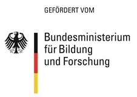

title: Projects

- - - 
###Pharmacological prevention of noise induced hearing loss

{style="width:400px; float:right; margin-left:1em"}

In this study, active substances are identified for the preventive treatment of noise induced temporary (TTS) and permanent (PTS) threshold shift. The selected growth factors glial cell line-derived neurotrophic factor, erythropoietin and insulin-like growth factor-1 are examined for their potential to protect the hearing from noise trauma.
Funding: German Research Foundation (DFG, SCHE 1663/3-1)

###Additive Technologies for Individualized Implants

{style="width:400px; float:right; margin-left:1em"}

Additive technologies such as 3D printing, inkjet printing, two-photon polymerization and micro-injection molding make it possible to adapt implants in shape to the individual anatomy of a patient while at the same time ensuring optimal drug loading. Within the scope of this project, precisely fitting implants to treat sudden sensory neural hearing loss and chronic sinusitis and customized for the patient will we developed in cooperation with project partners in Rostock, Greifswald, Leipzig and Hannover.
  Funding: Federal Ministry of Education and Research (Bundesministerium für Bildung und Forschung, BMBF; Project: RESPONSE – Partnerschaft für Innovation in der Implantattechnologie [http://www.response.uni-rostock.de/?L=1](http://www.response.uni-rostock.de/?L=1).

###ACEMg-Supplement Mediated Hearing Preservation in Cochlear Implant Patients Receiving Different Electrode Lengths
This is a follow-up project of the European Union funded project PROHEARING which was finalized in summer 2016. In PROHEARING we investigated the effect of an investigational medicinal product called _Soundbites_. The indication for a cochlear implant has expanded to patients with some residual hearing. Shorter and thinner atraumatic electrodes have been designed to preserve the residual hearing in the implanted ear. However, the insertion of the electrode array into the cochlea, with potential mechanical trauma and the presence of this foreign body inside the cochlea, may lead to free radical formation and reduced blood perfusion of the cochlea which can result in a loss of residual hearing. This new project is a single center, randomized, placebo-controlled, double-blind
phase II clinical trial investigating the effect of free radial scavengers and a vasodilator on the residual hearing of 140 CI-patients. 
Funding: MHH Förderstiftung Plus

###Neuroprotective and –regenerative Effects of Cometin 
The protective and regenerative effects of the neurotrophic growth factor cometin are investigated in in vitro studies using primary auditory neurons. Human versus murine protein in different concentrations are tested.
Funding: Hoba Therapeutics, Denmark [http://hobatherapeutics.com/index.html](http://hobatherapeutics.com/index.html)

###STED-based Automated Fibrosis and Neuron Quantification in Cochlear Implanted Inner Ears
Bony tissue will be processed for clearing following modified established protocolls for soft tissue clearance. The cleared tissue will be imaged using STED and protocols for automated counting of neuronal cells as well as automated detection of fibrosis quantity will be implemented. The goal is to establish a clearing protocol with following automated tissue analysis using STED in an implanted bony structure, the inner ear.

