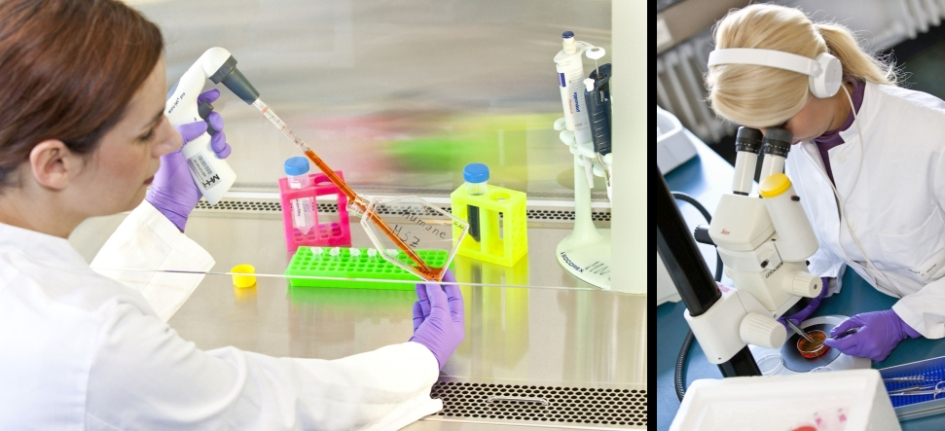

title: Warnecke Lab - Protection and Regeneration of the Inner Ear

Protection and regeneration of the inner ear may enhance the performance that can be achieved with a Cochlea Implant. Our group focuses on the development of pharmacological treatment for the protection and regeneration of the inner ear. Development of biohybrid electrodes will facilitate not only the cell-based application of pharmacologically active substances over a long term locally to the inner ear but also reduction of foreign body reaction and inflammation. Human mesenchymal stem cells (MSC) will be utilized as autologous cell source for the cell based systems. These cells have immunomodulatory properties and may prevent foreign body reaction and inflammation further enhancing the performance of the implants. In this context, genetic modification as well as structuring of the implant surface will be performed in order to induce and control differentiation of processes of MSC. In addition, the endogenous regenerative capacities of the inner ear will be explored in model systems in vitro and in vivo. Stem cell technology, molecular biology as well as modern imaging technologies are combined in an interdisciplinary approach to pursue our envisaged goals.

 
***

**Contact Information:**

    PD. Dr. med. A. Warnecke
    Medizinische Hochschule Hannover
    Carl-Neuberg-Str. 1
    30625 Hannover
<Warnecke.Athanasia@mh-hannover.de> 
